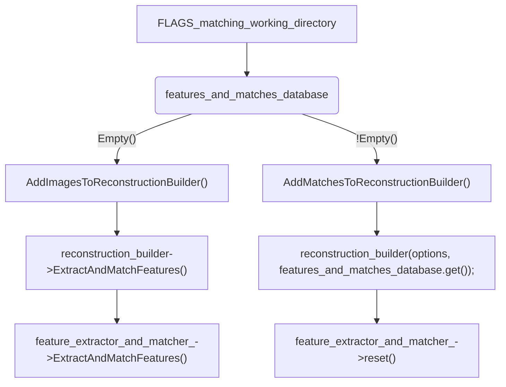
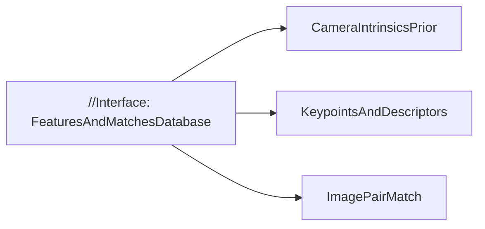
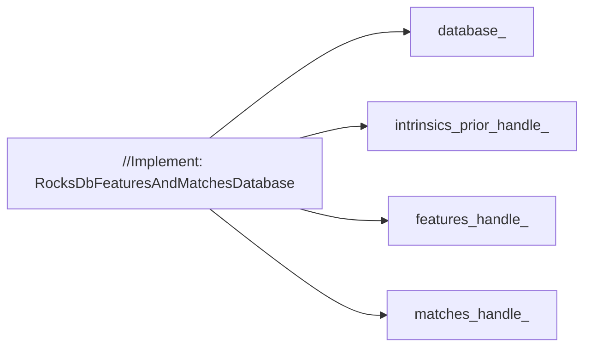

## 0 重建之源
上一篇博客在概述了TheiaSfM的架构后简单介绍了外部参数、日志和测试模块，接下来需要思考另一类外部输入：图像或特征及匹配。

由`build_reconstruction.cc`中的代码可知，程序会在标志参数`FLAGS_matching_working_directory`提供的目录下找到特征和匹配对数据集`RocksDbFeaturesAndMatchesDatabase`，并将数据集作为初始化重建类`ReconstructionBuilder`的一个参数，根据数据集匹配对是否为空来决定是将匹配对还是图像添加进重建类作为数据源。那么我们先从图像开始，依次探究这两类输入源在TheiaSfM中的组织和IO流。

## 1 图像
### 1.1 将图像添加进重建类
同样，自顶而下地，我们从`build_reconstruction.cc`中将图像加入到重建类`ReconstructionBuilder`开始。

```cpp
void AddImagesToReconstructionBuilder(
    ReconstructionBuilder* reconstruction_builder) {
  std::vector<std::string> image_files;
  CHECK(theia::GetFilepathsFromWildcard(FLAGS_images, &image_files))
      << "Could not find images that matched the filepath: " << FLAGS_images
      << ". NOTE that the ~ filepath is not supported.";

  CHECK_GT(image_files.size(), 0) << "No images found in: " << FLAGS_images;

  if (image_files.size() > FLAGS_max_num_images) {
    image_files.resize(FLAGS_max_num_images);
  }
  
  // Load calibration file if it is provided.
  std::unordered_map<std::string, theia::CameraIntrinsicsPrior>
      camera_intrinsics_prior;
  if (FLAGS_calibration_file.size() != 0) {
    CHECK(theia::ReadCalibration(FLAGS_calibration_file,
                                 &camera_intrinsics_prior))
        << "Could not read calibration file.";
  }

  // Add images with possible calibration. When the intrinsics group id is
  // invalid, the reconstruction builder will assume that the view does not
  // share its intrinsics with any other views.
  theia::CameraIntrinsicsGroupId intrinsics_group_id =
      theia::kInvalidCameraIntrinsicsGroupId;
  if (FLAGS_shared_calibration) {
    intrinsics_group_id = 0;
  }

  for (const std::string& image_file : image_files) {
    std::string image_filename;
    CHECK(theia::GetFilenameFromFilepath(image_file, true, &image_filename));

    const theia::CameraIntrinsicsPrior* image_camera_intrinsics_prior =
        FindOrNull(camera_intrinsics_prior, image_filename);
    if (image_camera_intrinsics_prior != nullptr) {
      CHECK(reconstruction_builder->AddImageWithCameraIntrinsicsPrior(
          image_file, *image_camera_intrinsics_prior, intrinsics_group_id));
    } else {
      CHECK(reconstruction_builder->AddImage(image_file, intrinsics_group_id));
    }
  }

  // Add black and write image masks for any images if those are provided.
  // The white part of the mask indicates the area for the keypoints extraction.
  // The mask is a basic black and white image (jpg, png, tif etc.), where white
  // is 1.0 and black is 0.0. Its name must content the associated image's name
  // (e.g. 'image0001_mask.jpg' is the mask of 'image0001.png').
  std::vector<std::string> mask_files;
  if (FLAGS_image_masks.size() != 0) {
    CHECK(theia::GetFilepathsFromWildcard(FLAGS_image_masks, &mask_files))
        << "Could not find image masks that matched the filepath: "
        << FLAGS_image_masks << ". NOTE that the ~ filepath is not supported.";
    if (mask_files.size() > 0) {
      for (const std::string& image_file : image_files) {
        std::string image_filename;
        CHECK(
            theia::GetFilenameFromFilepath(image_file, false, &image_filename));
        // Find and add the associated mask
        for (const std::string& mask_file : mask_files) {
          if (mask_file.find(image_filename) != std::string::npos) {
            CHECK(reconstruction_builder->AddMaskForFeaturesExtraction(
                image_file, mask_file));
            break;
          }
        }
      }
    } else {
      LOG(WARNING) << "No image masks found in: " << FLAGS_image_masks;
    }
  }

  // Extract and match features.
  CHECK(reconstruction_builder->ExtractAndMatchFeatures());
}
```

1. 读取图像路径。通过`GetFilepathFromWildcard`在带匹配规则[^1]的图像路径`FLAGS_images`下获取所有图像图像，比如`<prefix>/images/*.jpg`，并保存至`image_files`中，确保图像数量在 $(0, \text{FLAGS_max_num_images}]$ 之间；
2. 读取图像内参。从包含图像内参的JSON文件中读取先验数据，这并非必须，也不需要提供所有图像的内参；

```json
{
    "priors" : [
      {"CameraIntrinsicsPrior" : {
        "image_name" : "view_1.jpg",
        "focal_length" : 300,
        "width" : 480,
        "height" : 480,
        "principal_point" : [240, 240],
        "aspect_ratio" : 1.0,
        "skew" : 0.0,
        "radial_distortion_coeffs" : [0.1, 0.01],
        "camera_intrinsics_type" : "PINHOLE"
       }},
      {"CameraIntrinsicsPrior" : {
        "image_name" : "view_2.jpg",
        "focal_length" : 300,
        "principal_point" : [240, 240],
        "aspect_ratio" : 1.0,
        "skew" : 0.0,
        "radial_distortion_coeffs" : [0.1, 0.01],
        "tangential_distortion_coeffs" : [0.05, 0.05],
        "latitude" : 120.0,
        "longitude" : 58.0,
        "altitude" : 64,
        "camera_intrinsics_type" : "PINHOLE_RADIAL_TANGENTIAL"
       }}
    ]
}
```

3. 添加图像至重建类。如果设定为所有图像共享内参`FLAGS_shared_calibration==true`，设定默认内参群id为0否则为`kInvalidCameraIntrinsicsGroupId`。遍历`image_files`，根据2中是否有内参先验以不同形式将对应的图像名、内参先验（如果有）和内参群id加入重建类；
4. 添加掩膜至重建类。如果提供了图像的二值图像掩膜，以类似方式`AddMaskForFeaturesExtraction(image_file, mask_file)`添加进重建类;
5. 提取并匹配特征。

### 1.2 图像类
在1.1中真正添加进重建类的是不含扩展名的图像名称，后面会提到TheiaSfM内部对图像还有一个标识是`ViewId`。但在做特征提取和匹配时需要对真正的图像数据进行操作。TheiaSfM对OpenImageIO中的图像类进行了进一步的封装，构建了一个像素值被归一化至 $[0,1]$ 的基础类`FloatImage`，支持灰度图和RGB彩图读取，常见的像素值访问和修改，以及插值、梯度、滤波等常用图像处理操作。

```cpp
FloatImage my_rgb_image(img_filename);

// Convert to grayscale.
FloatImage my_grayscale_image = my_rgb_image.AsGrayscaleImage();

// Get the middle pixel location.
int middle_x = my_rgb_image.Width()/2;
int middle_y = my_rgb_image.Height()/2;

// Grab the middle pixel.
const Eigen::Vector3f middle_xy_pixel = my_rgb_image.GetXY(middle_x, middle_y);

// Write the image back out.
my_rgb_image.Write(out_rgb_filename);
my_grayscale_image.Write(out_grayscale_filename);
```
### 1.3 图像缓存
TheiaSfM提供LRU（Least Recently Used）缓存用于图像读取（但疑似只提供接口而未使用），LRU是一种常用的缓存淘汰算法，用于管理固定大小的缓存中的数据。当缓存满时，LRU算法会淘汰最长时间未被使用的数据，以便为新的数据腾出空间。这种策略的核心思想是：如果数据在最近一段时间内没有被访问过，那么在未来一段时间内被访问的可能性也很小。在util/lru_cache.h中定义了模板类`LRUCache`，接受两个类型模板参数`KeyType`和`ValueType`分别代表缓存中键和值的类型。

然后基于`LRUCache`进一步封装得到图像缓存类`ImageCache`。

```cpp
class ImageCache {
public:
 ImageCache(const std::string& image_directory,
            const int max_num_images_in_cache);
 ~ImageCache();

 const std::shared_ptr<const theia::FloatImage> FetchImage(
     const std::string& image_filename) const;

 private:
  typedef LRUCache<std::string, std::shared_ptr<const theia::FloatImage> >
      ImageLRUCache;

  std::shared_ptr<const theia::FloatImage> FetchImagesFromDisk(
      const std::string& image_filename);

  std::string image_directory_;

  std::unique_ptr<ImageLRUCache> images_;
};

```

从`ImageCache`中获取的图像均为`std::shared_ptr<const theia::FloatImage>`类型，并设定内部LRU缓存类为`LRUCache<std::string, std::shared_ptr<const theia::FloatImage>>`。需要注意的是`image_directory`为图像根目录，并且默认所有图像在同一路径。

## 2 特征
## 2.1 关键点
TheiaSfM首先封装了个`Keypoint`类，包含`{type, x, y, strength, scale, orientation}`这些关键点信息。相比之下，`cv::KeyPoint`多了`octave`金字塔层数的信息，这是SIFT特征的关键属性，TheiaSfM中提供了SIFT和AKAZE两类特征。在只针对灰度图像进行特征提取的前提下，TheiaSfM进一步提供关键点检测子的纯虚类`KeypointDetctor`，而SIFT实现则是对VLFeat中的SIFT算子的封装，并用`SiftParameters`控制参数，提取的描述子以`std::vector<Keypoint>`形式存储。`Keypoint`还用到了Cereal进行序列化IO，这里等到后续博客提到IO部分再展开。

```cpp
extern "C" {
#include <vl/sift.h>
}

#include <vector>

#include "theia/image/keypoint_detector/keypoint_detector.h"
#include "theia/image/keypoint_detector/sift_parameters.h"
#include "theia/util/util.h"

namespace theia {
class FloatImage;
class Keypoint;

class SiftDetector : public KeypointDetector {
 public:
  explicit SiftDetector(const SiftParameters& sift_params) :
      sift_params_(sift_params), sift_filter_(nullptr) {}
  SiftDetector(int num_octaves, int num_levels, int first_octave)
      : sift_params_(num_octaves, num_levels, first_octave),
        sift_filter_(nullptr) {}
  SiftDetector() : sift_filter_(nullptr) {}
  ~SiftDetector();

  bool DetectKeypoints(const FloatImage& image,
                       std::vector<Keypoint>* keypoints);
 private:
  const SiftParameters sift_params_;
  VlSiftFilt* sift_filter_;

  DISALLOW_COPY_AND_ASSIGN(SiftDetector);
};

```
上述代码中的`DISALLOW_COPY_AND_ASSIGN`是禁用拷贝和赋值函数的宏，原理就是将其声明在`private:`下禁止外部访问。

```cpp
#define DISALLOW_COPY_AND_ASSIGN(TypeName) \
  TypeName(const TypeName&);               \
  void operator=(const TypeName&)
```

虽然提供了AKAZE的enum标识和子目录下AKAZE的源码，TheiaSfM并没有对特征点提取子做封装，但封装了描述子。

## 2.2 描述子
类似地，定义`DescriptorExtractor`作为描述子的纯虚基类，提取的描述子以`std::vector<Eigen::VectorXf>`形式存储，比如SIFT描述子就是 $\text{num_features} \times 128$。之后各自调用外部库的实现，封装`SiftDescriptorExtractor`和`AkazeDescriptorExtractor`。

```cpp
struct AkazeParameters {
  int maximum_octave_levels = 4;
  int num_sublevels = 4;
  float hessian_threshold = 0.001f;
};

class AkazeDescriptorExtractor : public DescriptorExtractor {
 public:
  explicit AkazeDescriptorExtractor(const AkazeParameters& detector_params)
      : akaze_params_(detector_params) {}
  ~AkazeDescriptorExtractor() {}

  bool ComputeDescriptor(const FloatImage& image,
                         const Keypoint& keypoint,
                         Eigen::VectorXf* descriptor);

  bool DetectAndExtractDescriptors(const FloatImage& image,
                                   std::vector<Keypoint>* keypoints,
                                   std::vector<Eigen::VectorXf>* descriptors);

 private:
  const AkazeParameters akaze_params_;

  DISALLOW_COPY_AND_ASSIGN(AkazeDescriptorExtractor);
};
```
调用TheiaSfM相关接口进行特征提取的示例：

```cpp
// Open image we want to extract features from.
FloatImage input_image(input_image_filename);

// Detect keypoints.
SiftDetector sift_keypoint_detector;
bool keypoint_detector_init = sift_keypoint_detector.Initialize();
const bool keypoint_init_success = sift_keypoint_detector.Initialize();
std::vector<Keypoint> sift_keypoints;
const bool detection_success =
    sift_keypoint_detector.DetectKeypoints(input_image, &sift_keypoints);

// Initialize descriptor extractor.
SiftDescriptorExtractor sift_extractor;
const bool descriptor_init_succes = sift_extractor.Initialize();

// E.g., compute a single descriptor
Eigen::VectorXf sift_descriptor;
bool sift_success =
  sift_extractor.ComputeDescriptor(input_image, keypoint[0], &sift_descriptor);

// E.g., compute many descriptors.
std::vector<Eigen::VectorXf> sift_descriptors;
const bool extraction_success =
  sift_extractor.ComputeDescriptors(image, &sift_keypoints, &sift_descriptors)
```
关键点和描述子代码主要是类封装，实现全在外部库。这里涉及到了后续代码会大量使用的矩阵库Eigen，其中的描述子类型就是`Eigen::VectorXf`，意为动态长度的浮点类型向量，后面我们会具体介绍Eigen库的常用内容。

## 3 特征匹配
首先回顾我们一张图提取的特征包括关键点`std::vector<Keypoint>`和描述子`std::vector<Eigen::VectorXf>`，而要想用到重建过程中，更关键的是需要获取特征匹配的结果，因为它能进一步提取出相对位姿。先看应用实例：

```cpp
FeatureMatcherOptions matcher_options;
FeatureMatcher matcher(matcher_options);
for (int i = 0; i < num_images_to_match; i++) {
  matcher.AddImage(image_names[i], keypoints[i], descriptors[i]);
  // Or, you could add the image with known intrinsics for use during geometric verification.
  matcher.AddImage(image_names[i], keypoints[i],
                   descriptors[i], intrinsics[i]);
}
std::vector<ImagePairMatch> matches;
matcher.MatchImages(&matches);
// Or, with geometric verification:
VerifyTwoViewMatchesOptions geometric_verification_options;
matcher.MatchImages(geometric_verification_options, &matches);
```

设定匹配相关的参数，根据参数初始化匹配类`FeatureMatcher`，依次将待匹配的图像添加进匹配类，如果有相应内参也可传入以便后续做几何验证。然后执行匹配，得到匹配结果`std::vector<ImagePairMatch>`。

在sfm模块中对特征提取和匹配做了进一步的封装，`FeatureExtractorAndMatcher`是真正的掌管添加图像、设置目标匹配对和保存匹配数据库的上层接口。此外，也会通过读取图像的EXIF信息设定内参先验，以用于几何验证。特征和匹配从外部到`ReconstructionBuilder`的层级关系为：


`FeaturesAndMatchesDatabase`是基础类。

`RocksDbFeaturesAndMatchesDatabase`是对应的实现类。

## 4 Eigen库简介
TODO:

## 参考
[^1]: Wildcard: n.通配符. [https://www.iciba.com/word?w=wildcard](https://www.iciba.com/word?w=wildcard)